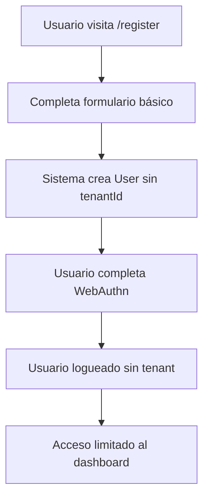
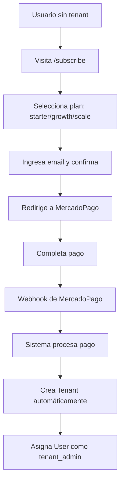
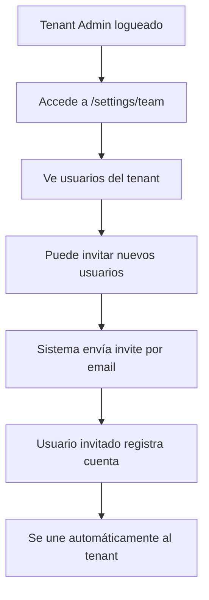

# 📋 Análisis Completo del Flujo de la Aplicación SecureApprove

## 🔍 Resumen Ejecutivo

Basado en el análisis exhaustivo del código Node.js/Next.js original, el sistema SecureApprove sigue un flujo específico donde **NO se crean tenants durante el registro inicial**. Los tenants se crean **únicamente después del pago exitoso** de una suscripción.

---

## 🏗️ Arquitectura del Sistema

### **Entidades Principales**

1. **User** - Usuario individual del sistema
2. **Tenant** - Organización/empresa que paga por el servicio  
3. **Invite** - Invitaciones para unirse a un tenant
4. **Billing** - Gestión de pagos y suscripciones

### **Roles de Usuario**
- `superadmin` - Administrador global del sistema
- `tenant_admin` - Administrador de la organización
- `requester` - Usuario que solicita aprobaciones
- `approver` - Usuario que aprueba/rechaza solicitudes
- `auditor` - Usuario que audita el sistema

---

## 🔄 Flujo Completo del Sistema

### **Fase 1: Registro Inicial (Sin Tenant)**



**Características:**
- ✅ Usuario se crea con `tenantId: null`
- ✅ Rol inicial: `requester`
- ✅ Acceso limitado al sistema
- ❌ NO puede crear solicitudes de aprobación
- ❌ NO tiene acceso a funcionalidades de tenant

### **Fase 2: Suscripción y Pago**



**Planes Disponibles:**
- **Starter**: $25/mes - Hasta 2 aprobadores - 10 asientos
- **Growth**: $45/mes - Hasta 6 aprobadores - 10 asientos  
- **Scale**: $65/mes - Aprobadores ilimitados - 10 asientos

### **Fase 3: Creación Automática de Tenant (Post-Pago)**

**Proceso automático en el webhook:**

```typescript
// 1. Usuario paga suscripción
// 2. MercadoPago envía webhook
// 3. Sistema procesa el pago exitoso

if (paymentInfo.status === 'approved') {
  const email = metadata.customerEmail || paymentInfo?.payer?.email;
  
  // Busca o crea usuario
  let user = await this.userModel.findOne({ email });
  if (!user) {
    user = new this.userModel({ 
      email, 
      role: 'tenant_admin', 
      isActive: true 
    });
    await user.save();
  }

  // Crea tenant si no existe
  if (!user.tenantId) {
    const key = email.split('@')[0].replace(/[^a-z0-9-]/gi, '').toLowerCase();
    const tenant = new this.tenantModel({
      key,
      name: key.charAt(0).toUpperCase() + key.slice(1),
      isActive: true,
      planId: metadata.planId,
      seats: Number(metadata.seats || 10),
      approverLimit: getApproverLimit(planId),
      status: 'active',
      billing: {
        provider: 'mercadopago',
        customerId: String(paymentInfo.payer?.id),
        subscriptionId: String(paymentInfo.id),
      }
    });
    await tenant.save();
    
    // Asigna usuario como admin del tenant
    user.tenantId = tenant._id.toString();
    user.role = 'tenant_admin';
    await user.save();
  }
}
```

### **Fase 4: Gestión de Equipo y Invitaciones**



**Sistema de Invitaciones:**
- ✅ Solo `tenant_admin` puede invitar
- ✅ Invitaciones por email con token único
- ✅ Usuario invitado se registra y se asigna automáticamente al tenant
- ✅ Control de límites por plan (seats y approvers)

---

## 🚨 Estados del Usuario

### **Usuario Sin Tenant (Pre-Pago)**
```json
{
  "id": "user123",
  "email": "user@example.com", 
  "name": "John Doe",
  "role": "requester",
  "tenantId": null,
  "isActive": true,
  "canAccess": [
    "/dashboard",
    "/profile", 
    "/subscribe"
  ],
  "cannotAccess": [
    "/requests",
    "/settings/team",
    "/users"
  ]
}
```

### **Usuario Con Tenant (Post-Pago)**
```json
{
  "id": "user123",
  "email": "user@example.com",
  "name": "John Doe", 
  "role": "tenant_admin",
  "tenantId": "tenant456",
  "isActive": true,
  "canAccess": [
    "/dashboard",
    "/requests",
    "/settings/team",
    "/users",
    "/profile"
  ]
}
```

---

## 🔐 Control de Acceso

### **Rutas Protegidas por Tenant**
```typescript
// Middleware que valida tenant
if (requiredTenant && !user.tenantId) {
  throw new ForbiddenException('Tenant subscription required');
}

// Validación de límites
if (user.tenantId) {
  const tenant = await Tenant.findById(user.tenantId);
  if (tenant.status !== 'active') {
    throw new ForbiddenException('Tenant subscription inactive');
  }
}
```

### **Límites por Plan**
- **Seats**: Número máximo de usuarios activos
- **Approvers**: Número máximo de usuarios con rol `approver`  
- **Status**: Estado de la suscripción (`active`, `past_due`, `canceled`)

---

## 🎯 Funcionalidades Según Estado

### **Pre-Suscripción (Sin Tenant)**
- ✅ Registro con WebAuthn
- ✅ Login biométrico
- ✅ Ver dashboard básico
- ✅ Editar perfil
- ✅ Acceder a página de suscripción
- ❌ Crear/ver solicitudes de aprobación
- ❌ Gestionar equipo
- ❌ Invitar usuarios

### **Post-Suscripción (Con Tenant Activo)**
- ✅ Todas las funcionalidades anteriores
- ✅ Crear solicitudes de aprobación
- ✅ Gestionar equipo (si es tenant_admin)
- ✅ Invitar usuarios (si es tenant_admin)
- ✅ Ver métricas y reportes
- ✅ Configurar tenant (si es tenant_admin)

---

## 🔄 Estados de Suscripción

### **Estados Posibles del Tenant**
1. **`active`** - Suscripción activa y funcionando
2. **`past_due`** - Pago atrasado (acceso limitado)
3. **`canceled`** - Suscripción cancelada 
4. **`paused`** - Suscripción pausada temporalmente

### **Comportamiento por Estado**
- **Active**: Acceso completo
- **Past Due**: Acceso limitado (solo lectura)
- **Canceled**: Sin acceso a funcionalidades de tenant
- **Paused**: Sin acceso a funcionalidades de tenant

---

## 📊 Flujo de Datos Críticos

### **Webhook de MercadoPago**
```javascript
POST /api/billing/webhooks/mercadopago
{
  "action": "payment.updated",
  "data": {
    "id": "payment_id"
  }
}

// Sistema consulta payment details
// Si approved: crea tenant + actualiza usuario
// Si failed: no hace nada
// Si pending: marca como pendiente
```

### **Creación de Tenant Automática**
```javascript
// Genera key desde email
const key = email.split('@')[0]
  .replace(/[^a-z0-9-]/gi, '')
  .toLowerCase()
  .slice(0, 24) || `tenant${Date.now()}`;

// Nombre capitalizado
const name = key.charAt(0).toUpperCase() + key.slice(1);
```

---

## 🚀 Implementación Requerida en Django

### **1. Modelo de Usuario Actualizado**
```python
class User(AbstractUser):
    tenantId = models.ForeignKey('Tenant', null=True, blank=True)
    role = models.CharField(choices=ROLE_CHOICES, default='requester')
    webauthn_credentials = models.JSONField(default=list)
    isActive = models.BooleanField(default=True)
```

### **2. Sistema de Suscripciones**
```python
class BillingService:
    def handle_webhook(self, payment_data):
        if payment_data['status'] == 'approved':
            # Crear tenant automáticamente
            # Asignar usuario como tenant_admin
            pass
```

### **3. Middleware de Control de Acceso**
```python
class TenantRequiredMiddleware:
    def __call__(self, request):
        if self.requires_tenant(request.path):
            if not request.user.tenantId:
                return redirect('/subscribe')
```

### **4. Vistas con Validación de Tenant**
```python
@tenant_required
def requests_view(request):
    # Solo accesible con tenant activo
    pass

def dashboard_view(request):
    # Contenido diferente según tenga tenant o no
    pass
```

---

## ✅ Conclusiones Clave

1. **NO crear tenant en registro inicial**
2. **Tenant se crea SOLO después del pago exitoso**
3. **Usuario sin tenant tiene acceso muy limitado**
4. **Sistema de invitaciones para agregar usuarios a tenant**
5. **Control de límites por plan de suscripción**
6. **WebAuthn para todos los usuarios independiente del tenant**

Este flujo asegura que solo las organizaciones que pagan tengan acceso completo al sistema de aprobaciones, mientras que permite a los usuarios individuales registrarse y probar la autenticación biométrica antes de comprometerse con un plan de pago.